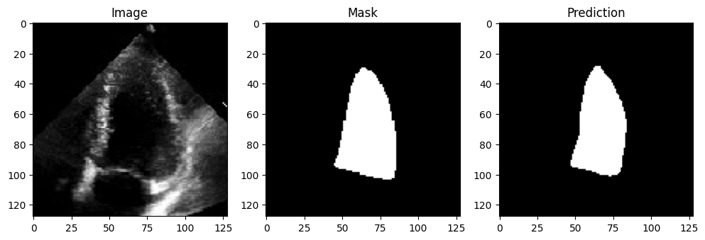
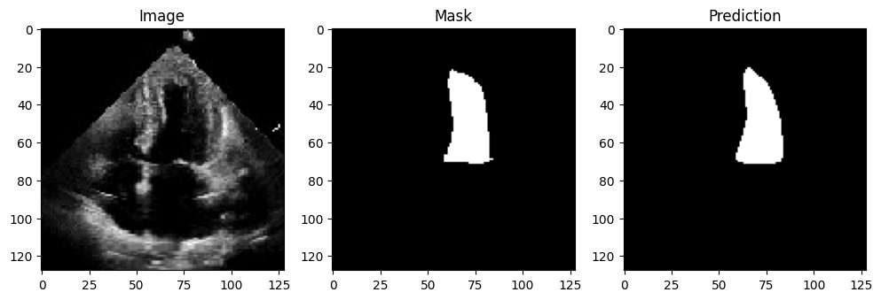
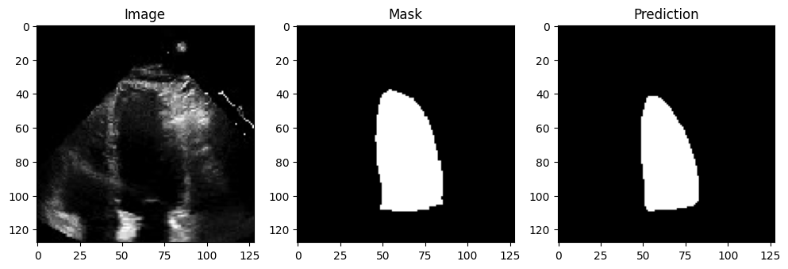

# LV Segmentation with U-Net

This project focuses on the segmentation of the Left Ventricle (LV) in medical images using a U-Net model, a type of convolutional neural network designed for image segmentation tasks. The goal is to accurately identify and delineate the LV region in cardiac images, which is crucial for various diagnostic and therapeutic applications. By leveraging the U-Net architecture, this notebook guides you through the entire process, from data loading and preprocessing to model training, evaluation, and visualization of results.

## Table of Contents
- [Introduction](#introduction)
- [Installation](#installation)
- [Usage](#usage)
- [Project Structure](#project-structure)
- [Results](#results)
- [Contributing](#contributing)
- [License](#license)

## Introduction
This notebook demonstrates the process of Left Ventricle (LV) segmentation using a U-Net model. The steps include:

1. **Mounting Google Drive**: Accessing the dataset stored in Google Drive.
2. **Cloning the Repository**: Downloading the necessary code and data from a GitHub repository.
3. **Installing Packages**: Installing required Python packages for segmentation models.
4. **Setting Environment Variables**: Configuring environment variables for TensorFlow Keras.
5. **Importing Libraries**: Importing essential libraries for data processing, model building, and visualization.
6. **Loading and Preprocessing Data**: Loading images and masks, applying data augmentation, and creating TensorFlow datasets.
7. **Defining the U-Net Model**: Setting model parameters, defining, compiling, and summarizing the U-Net model.
8. **Training the Model**: Training the model on the training dataset and validating it on the validation dataset.
9. **Saving the Model**: Saving the trained model for future use.
10. **Evaluating the Model**: Evaluating the model's performance using the Mean Intersection over Union (IoU) metric.
11. **Testing on Random Images**: Testing the model on random images from the validation dataset and visualizing the results.

**Notably, the model achieved a Mean Intersection over Union (IoU) of 91.8% on the test data, demonstrating its high accuracy and effectiveness.**

## Installation
To run this notebook, you need to have Python and the following packages installed:

- TensorFlow
- segmentation-models
- numpy
- matplotlib
- glob
- random
- os

You can install the required packages using the following commands:

```bash
pip install tensorflow
pip install segmentation-models
pip install numpy==1.23
pip install matplotlib
```
## Usage
1. **Clone the repository**:
    ```bash
    git clone https://github.com/4prince8/LV-Segmentation-with-U-Net.git
    cd LV-Segmentation-with-U-Net
    ```

2. **Open the Jupyter notebook**:
    ```bash
    jupyter notebook LV_Segmentation.ipynb
    ```

3. **Run the notebook**:
    Follow the steps in the notebook to mount Google Drive, install necessary packages, load and preprocess data, define and train the model, and evaluate the results.

## Project Structure

```
LV-Segmentation-with-U-Net/
├── DATA/
│   ├── frames/
│   └── masks/
├── LV_Segmentation_with_U_Net.ipynb
└── README.md
```


- `DATA/`: Directory containing the image frames and masks.
- `LV_Segmentation_with_U_Net.ipynb`: Jupyter notebook with the complete code for LV segmentation.
- `README.md`: This file.

## Results
The model achieved a Mean Intersection over Union (IoU) of 91.8% on the test data, demonstrating its high accuracy and effectiveness. Below are some sample results:





## Contributing
Contributions are welcome! Please feel free to submit a Pull Request.

## License
This project is licensed under the MIT License - see the [LICENSE](LICENSE) file for details.

